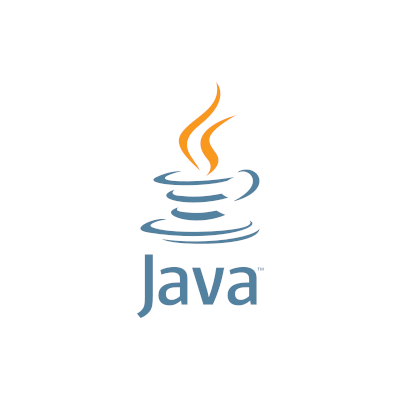
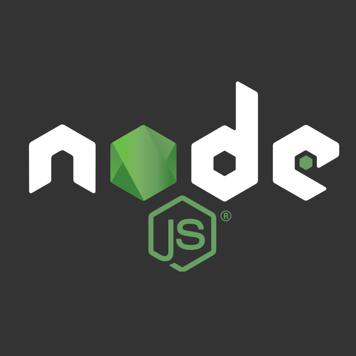
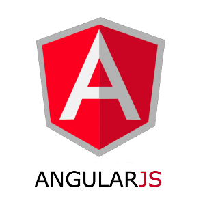

### Hi there, I'm Yen Huynh 👋
$About \ \ me$
-
```diff
😎 Self-leaner Web Development
🫡 Concentrate in Front-end environment
📖 Intermediate in HTML, CSS, JS
📑 Beginner in React.js
```
$Background \ \ information$
-
```diff
Perform an Advanced Diploma Degree in Computer Engineering Technology (2022 - 2025)
Obtained experience in communication skills, design, implementation, and maintainance
Open to work in any position as Front-end Developer roles
```

$Availabilities$
-

Timezone: EST/ UTC-5
| Monday | Tuesday | Wednesday | Thursday | Friday | Saturday | Sunday |
| ------ | ------- | --------- | -------- | ------ | -------- | ------ |
| 7 A.M - 8 P.M | 7 A.M - 8 P.M | 7 A.M - 8 P.M | 7 A.M - 8 P.M | 7 A.M - 8 P.M | 7 A.M - 8 P.M | Not available |

```diff
git checkout -b 'CodingForLife'
git add 'Fun, Patient, Concentrate'
git commit -m 'JS, HTML, CSS'
git push -u origin 'Front-end Developer'
```
---
$Languages$

<code></code>
<code></code>
<code></code>
<code></code>
<code></code>

$Database$

<code></code>
<code></code>

$Frameworks$

<code></code>
<code></code>
<code></code>
<code></code>

$Technologies$

<code></code>
<code></code>
<code></code>
<code></code>
<code></code>

$Resume$
