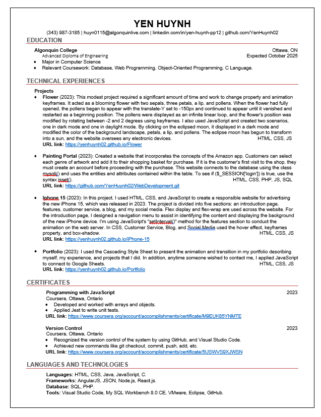
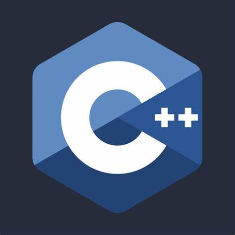
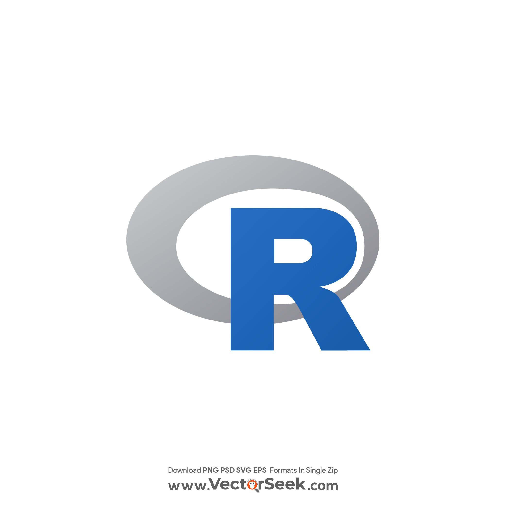

<h1 align="center">Hi there, I'm Yen Huynh </h1>
<h3 align="center">🖥️ Front-End Engineer | Future Full Stack Pioneer 🖥️</h3>

<p align="center">
<code></code>
</p>

$$Resume$$
-
<p align="center">
      <a href="images/Resume - Yen Huynh.pdf" download></a>
</p>

<br>

---
$$About \ \ me$$
-
```diff
😎 Self-leaner Web Development
🫡 Concentrate in Front-end environment
📖 Intermediate in HTML, CSS, JS
📑 Beginner in React.js
```

<br>

---
$$Background \ \ information$$
-
```diff
Perform an Advanced Diploma Degree in Computer Engineering Technology (2022 - 2025)
Obtained experience in communication skills, design, implementation, and maintainance
Open to work in any position as Front-end Developer roles
```

<br>

---
$$Availabilities$$
-
Timezone: EST/ UTC-5
| Monday | Tuesday | Wednesday | Thursday | Friday | Saturday | Sunday |
| ------ | ------- | --------- | -------- | ------ | -------- | ------ |
| 7 A.M - 8 P.M | 7 A.M - 8 P.M | 7 A.M - 8 P.M | 7 A.M - 8 P.M | 7 A.M - 8 P.M | 7 A.M - 8 P.M | Not available |

```diff
git checkout -b 'CodingForLife'
git add 'Fun, Patient, Concentrate'
git commit -m 'JS, HTML, CSS'
git push -u origin 'Front-end Developer'
```
<br>

---

$$Languages \\ and \\ Technologies$$
--

$$Languages$$
<p align="center">
<code></code>
<code></code>
<code></code>
<code></code>
<code></code>
<code></code>
<code></code>
<code></code>
</p>

$$Technologies$$

<p align="center">
<code></code>
<code></code>
<code></code>
<code></code>
<code></code>
<code></code>
<code></code>
<code></code>
</p>

$$Frameworks$$

<p align="center">
<code></code>
<code></code>
<code></code>
<code></code>
</p>

$$Database$$

<p align="center">
<code></code>
<code></code>
</p>
